# localpass

[]()
[]()
[]()
[]()

> A local-first, zero-knowledge password manager.
> Terminal UI + browser extension.
> No cloud. No accounts. No telemetry. Everything stays on your machine.

---

## Terminal App

<table>
<tr>
<td>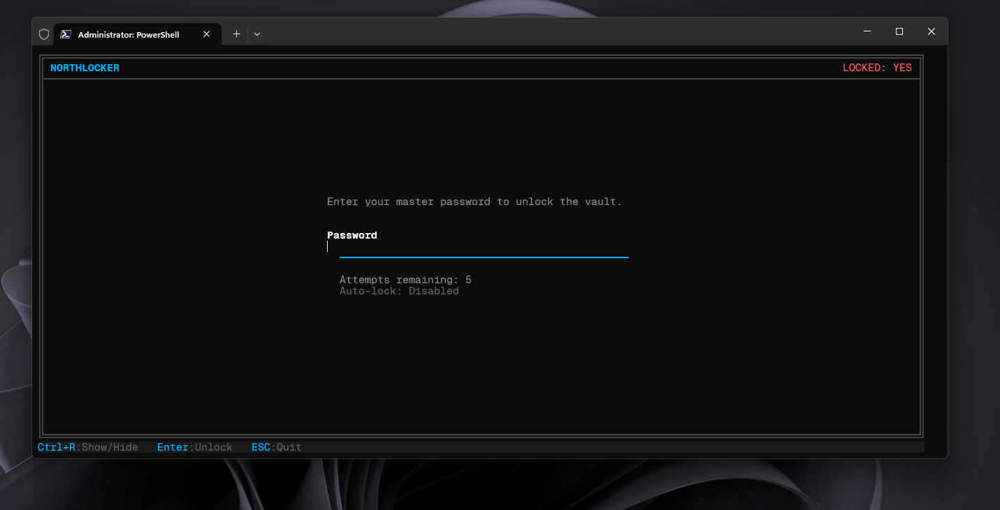<br><sub>Unlock Screen</sub></td>
<td>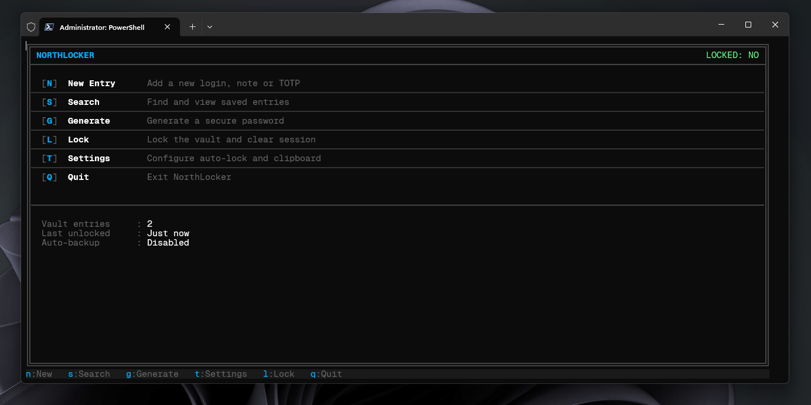<br><sub>Dashboard</sub></td>
</tr>
<tr>
<td>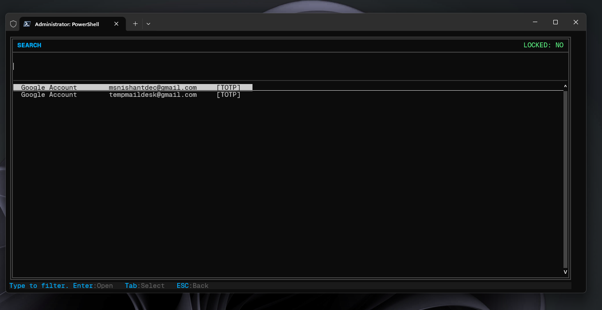<br><sub>Search</sub></td>
<td>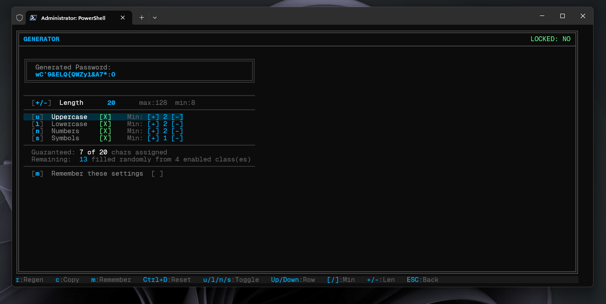<br><sub>Password Generator</sub></td>
</tr>
<tr>
<td>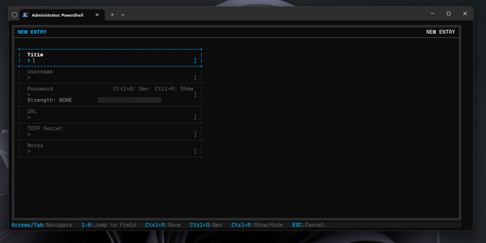<br><sub>New Entry Form</sub></td>
<td>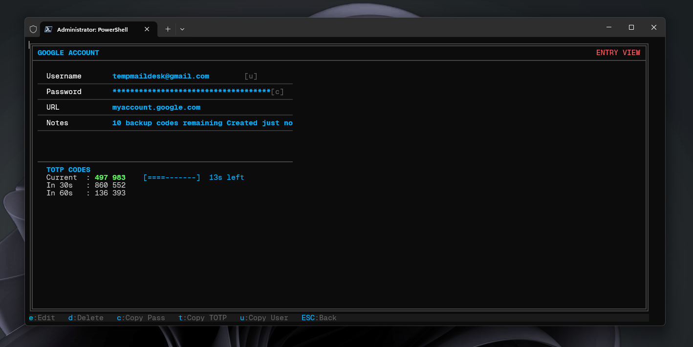<br><sub>Entry View with TOTP</sub></td>
</tr>
</table>

---

## Browser Extension

<table>
<tr>
<td>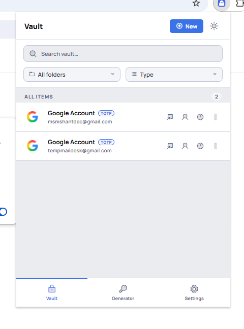<br><sub>Vault Entries</sub></td>
<td>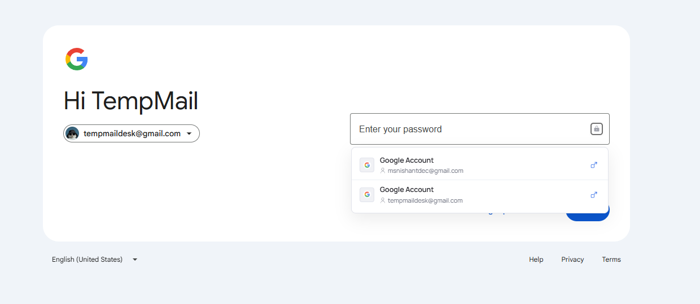<br><sub>Autofill Dropdown</sub></td>
<td>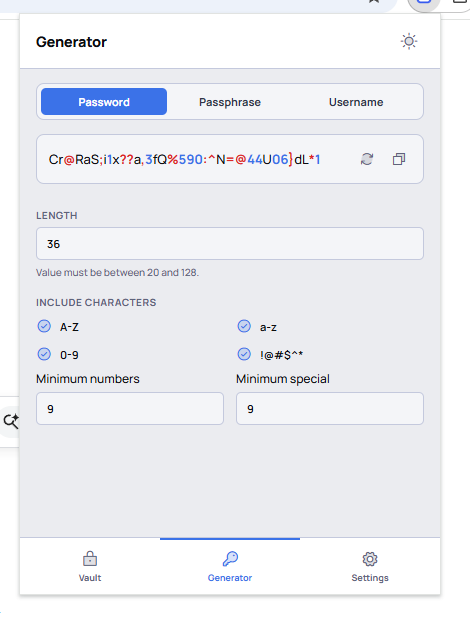<br><sub>Password Generator</sub></td>
</tr>
<tr>
<td>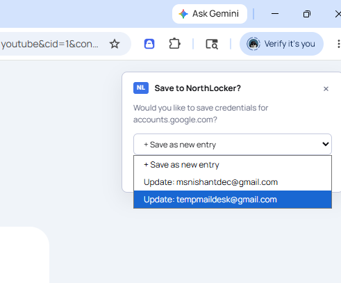<br><sub>Save Entry</sub></td>
<td>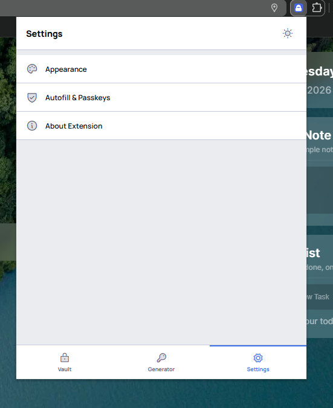<br><sub>Settings</sub></td>
<td>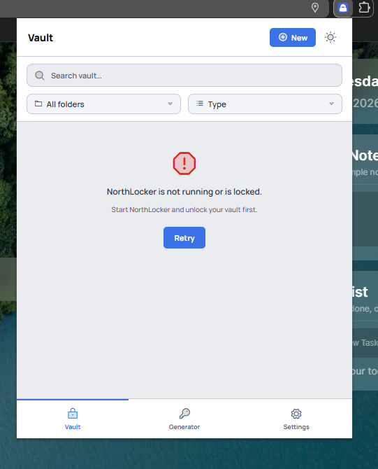<br><sub>Not Connected State</sub></td>
</tr>
</table>

---

## Features

| Feature | Terminal App | Browser Extension |
|---|---|---|
| AES-256-GCM Encryption | yes | reads via server |
| Argon2id Key Derivation | yes | n/a |
| Password Autofill | n/a | yes |
| TOTP Generation | yes | yes |
| Password Generator | yes | yes |
| Passkey Storage | yes | yes |
| Zero Knowledge | yes | yes |
| Fully Offline | yes | yes |
| Inline Dropdown | n/a | yes |
| Dark / Light Mode | dark only | yes |

---

## Security

localpass uses AES-256-GCM authenticated encryption.
The master password is never stored. A 256-bit key is
derived using Argon2id with 64MB memory cost and 3
time iterations. The encrypted vault file is a binary
blob that is indistinguishable from random data without
the master password.

The browser extension never receives plaintext passwords
via the GET_CREDENTIALS endpoint. Passwords are only
transmitted locally via the /fill endpoint when the
user explicitly triggers autofill.

[Full security model](docs/architecture/security-model.md)

---

## Quick Start

```powershell
git clone https://github.com/nishantdec/localpass.git
cd localpass
pip install -r requirements.txt --break-system-packages
python localpass/main.py
```

[Full setup guide](QUICKSTART.md) •
[Load the extension](docs/extension/setup.md)

---

## Documentation

[docs/index.md](docs/index.md) — complete documentation index

| Section | Link |
|---|---|
| Architecture | [docs/architecture/overview.md](docs/architecture/overview.md) |
| Security Model | [docs/architecture/security-model.md](docs/architecture/security-model.md) |
| API Reference | [docs/api/local-server-api.md](docs/api/local-server-api.md) |
| Extension Setup | [docs/extension/setup.md](docs/extension/setup.md) |
| Debugging | [docs/guides/debugging.md](docs/guides/debugging.md) |

---

## Tech Stack

| Component | Technology |
|---|---|
| Language | Python 3.11+ |
| Terminal UI | prompt_toolkit + rich |
| Encryption | AES-256-GCM via cryptography |
| Key Derivation | Argon2id via argon2-cffi |
| TOTP | pyotp |
| Extension | Vanilla JS, Manifest V3 |
| Browser Support | Chrome, Edge |

---

## Project Structure
localpass/
├── localpass/            Python terminal app
│   ├── core/             Encryption, vault, entries, TOTP
│   ├── ui/               TUI screens and components
│   ├── utils/            Clipboard, config, paths
│   └── server/           Local HTTP server
├── localpass-extension/  Browser extension
│   ├── background/       Service worker modules
│   ├── content/          Page injection scripts
│   ├── popup/            Extension popup UI
│   └── utils/            Shared utilities
├── docs/                 Full documentation
└── assets/               Screenshots and diagrams

---

## Roadmap

- [ ] Local network mode (other devices on same WiFi)
- [ ] Web frontend (access from phone browser)
- [ ] Multi-user accounts
- [ ] Encrypted cloud backup (self-hosted)
- [ ] Firefox extension
- [ ] Mobile app

---

## License

MIT License. See LICENSE file.
