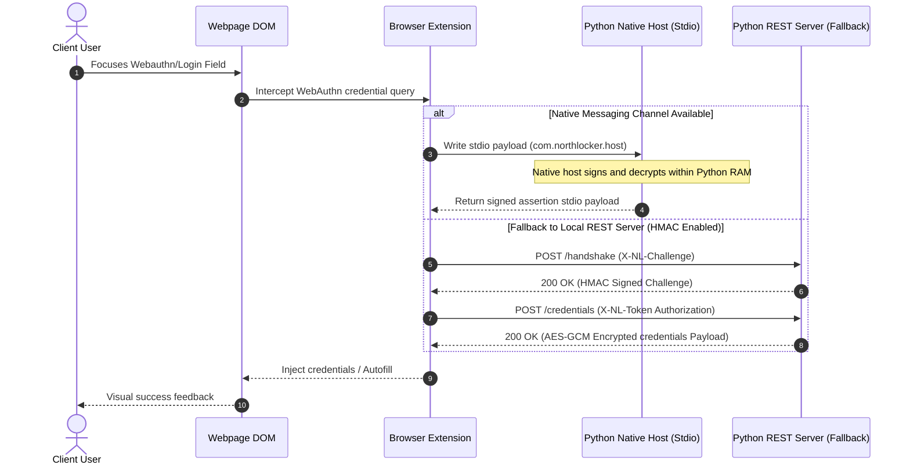
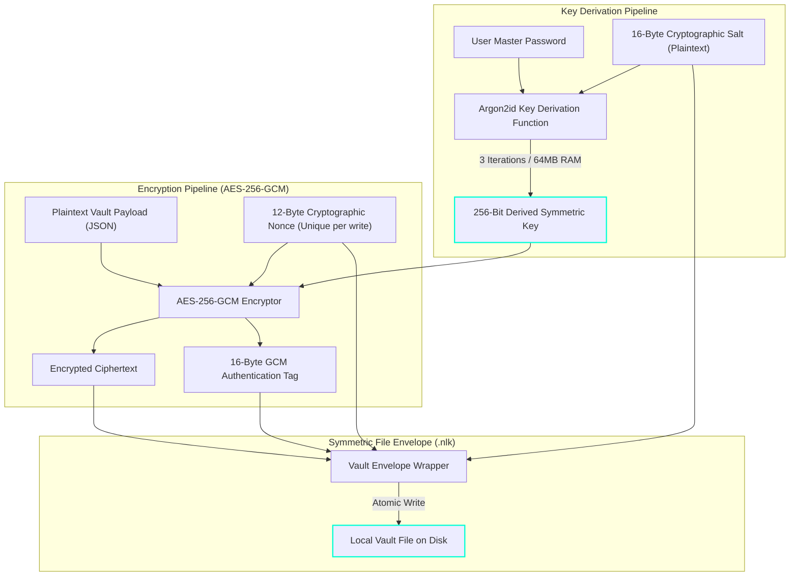

[Home](https://github.com/nishantdec/localpass/blob/main/README.md) •
[Docs Index](../index.md) •
[Quick Start](https://github.com/nishantdec/localpass/blob/main/QUICKSTART.md) •
[Glossary](../reference/glossary.md)

---

# Architectural Decisions & Security Models

This document serves as the formal design record for the architectural trade-offs, security considerations, and system workflows implemented inside `localpass`.

---

## 1. Process Communication: Stdio Pipes vs. TCP Ports {#stdio-vs-tcp}

### The Problem
In early iterations, the browser extension communicated with the Python background service worker solely via standard TCP sockets on a local port (e.g. `localhost:5000`). This approach suffered from critical security and operational vulnerabilities:
1.  **Port Collisions**: If another application bound to port 5000, `localpass` would fail to start.
2.  **CORS/Phishing Vulnerability**: Malicious scripts running on open tabs could attempt to query `localhost:5000` directly. While CORS and HMAC tokens mitigated this, it significantly expanded the threat surface.
3.  **DNS Rebinding**: A malicious site could exploit DNS rebinding to bypass loopback isolation and send requests directly to the daemon.

### The Solution: Native Messaging with Stdio Pipes
`localpass` transitioned to a hybrid communication architecture prioritizing **Chrome Native Messaging** over stdio pipes:
*   **Zero Port Binding**: The browser launches the Python native host process directly as a subprocess. Communication is performed via raw binary standard input (`stdin`) and standard output (`stdout`) streams.
*   **Cryptographic Isolation**: Since no network ports are bound, external network clients or browser pages cannot reach the native host, completely eliminating DNS rebinding and CORS spoofing.
*   **HTTP Fallback**: A local loopback server (`localhost:28482`) is maintained *only* as a secondary transport, protected by rigid origin filtering, constant-time HMAC challenge-response handshakes, and short-lived session tokens.

---

## 2. Process Communication Flowchart {#process-flowchart}

The following sequence diagram outlines the transaction flow of a FIDO2 WebAuthn authentication query over Chrome Native Messaging and the loopback fallback:

---

## 3. Vault Envelope Cryptography Pipeline {#envelope-crypto}

`localpass` secures credentials using a zero-knowledge envelope encryption model. The master password is processed through a memory-hard key derivation function (Argon2id) to yield a 256-bit symmetric key. This key is used with AES-256-GCM to encrypt/decrypt the vault payload.

---

## 4. Why SQLCipher and Local SQL Servers Failed {#sql-post-mortem}

During early architectural reviews, storing data inside a local SQLite database encrypted via SQLCipher was evaluated and ultimately rejected:

1.  **Shared Memory Protections**: Standard database files require writing pages to disk and memory caches that can leak keys or plaintext data to swap space.
2.  **Compilation Complexity**: Compiling SQLCipher across multiple targets (Windows, macOS, Linux) introduced massive dependency overhead and compilation failures for target developers.
3.  **Atomic Envelope Security**: An atomic single-file binary blob (`.nlk`) allows `localpass` to read the entire vault into secure memory on unlock, decrypt it once, and completely zero out the key buffer when locked. No database files or indices remain on disk, rendering data forensic harvesting impossible.

---

## See Also
*   [Security Model](security-model.md)
*   [System Overview Diagram](diagrams/system-overview.md)
*   [Local Server API](../api/local-server-api.md)
*   [Vault File Format](../api/vault-file-format.md)

---
*[Back to Docs Index](../index.md) •
[Back to Top](#)*
