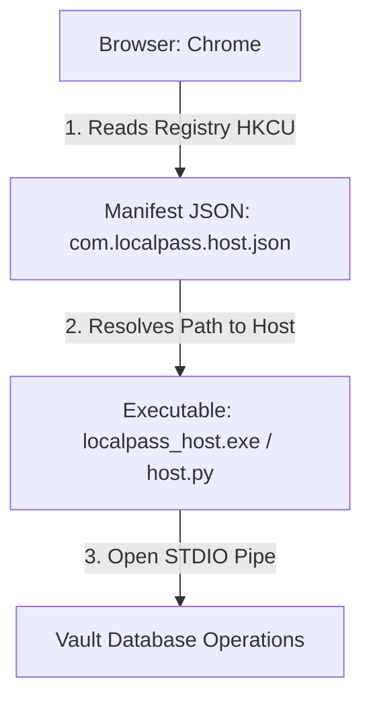

[Home](https://github.com/nishantdec/localpass/blob/main/README.md) •
[Docs Index](../index.md) •
[Quick Start](https://github.com/nishantdec/localpass/blob/main/QUICKSTART.md) •
[Glossary](../reference/glossary.md)

---

# Developer Setup Guide: Chrome Extension & Native Host: `docs/extension/setup.md`

This guide provides a detailed, step-by-step walkthrough for developers to install, configure, and debug the **localpass WebExtension** and its background native messaging host on a development machine.

---

## 1. Extension Installation (Developer Mode)

The localpass extension is built on **WebExtension Manifest V3** and runs on Chromium browsers (Chrome, Edge, Brave, Opera) and Mozilla Firefox.

### Step-by-Step Chromium Setup
1.  Open your browser and navigate to the extension administration portal:
    *   **Chrome:** `chrome://extensions/`
    *   **Edge:** `edge://extensions/`
2.  Enable the **Developer mode** toggle switch in the top right corner.
3.  Click the **Load unpacked** button in the top left.
4.  Navigate to your workspace directory and select the **`localpass-extension/`** folder.
5.  The extension is now installed. Pin the localpass shield icon to your toolbar for quick access.

---

## 2. Registering the Native Messaging Host

The native host enables secure, local communications without exposing TCP ports. It uses standard input/output pipes (STDIO) to bridge the extension with the core Python backend.



### Windows Registry Registration Steps
Open an elevated PowerShell shell in the workspace directory and execute the following:

```powershell
# 1. Install required dependencies
pip install -r requirements.txt

# 2. Run the automated host registry installer script
python localpass/native_host/manifest_installer.py
```

### How the Installer Configures the Host
*   Generates a JSON manifest file named `com.localpass.host.json` inside the host folder.
*   Populates the manifest path pointing directly to your local Python interpreter and the target script `localpass/native_host/host.py`.
*   Creates a Windows Registry Key under:
    `HKEY_CURRENT_USER\Software\Google\Chrome\NativeMessagingHosts\com.localpass.host`
    with the default value pointing to the newly generated JSON manifest.

---

## 3. Fallback Local HTTP Server Configuration

If native messaging is disabled or unavailable, the extension automatically falls back to standard HTTP localhost polling via `http://127.0.0.1:27432`.

### Starting the Fallback Server
To test the legacy HTTP loopback bridge, start the server manually:

```powershell
python server/local_server.py
```

### Verification Verification
Verify the server is running by making a test request:
```powershell
Invoke-RestMethod -Uri "http://127.0.0.1:27432/ping" -Method Get
# Expected Output: {"status": "ok", "locked": true} (if vault is locked)
```

---

## 4. Developer Debugging and Diagnostics

### A. Inspecting the Background Service Worker
Background events, native messaging handshakes, and caching logs are handled in `background.js` by the service worker.
1.  Navigate to `chrome://extensions/`.
2.  Locate the localpass card and click **Inspect views: Service Worker**.
3.  The DevTools console opens to monitor active message transactions, payload validations, and native host handshakes.

### B. Inspecting the Frontend Popup Views
To debug popup interface layouts, routing, or settings updates:
1.  Click the pinned **localpass** icon in your browser toolbar to open the popup.
2.  Right-click anywhere inside the popup window and select **Inspect**.
3.  The standard browser DevTools panel opens, allowing you to debug elements, analyze style rules in `popup.css`, or run console commands.

---

## See Also
- [Background](background/background.md)
- [Popup](popup/popup.md)
- [Bridge](utils/bridge.md)

---
*[Back to Docs Index](../index.md) •
[Back to Top](#)*