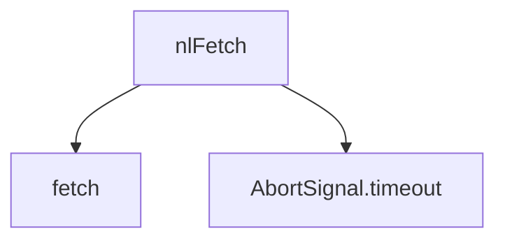

[Home](../../../README.md) •
[Docs Index](../../index.md) •
[Quick Start](../../../QUICKSTART.md) •
[Glossary](../../reference/glossary.md)

---

# Extension Secure API Bridge: `docs/extension/utils/bridge.md`

This document details the design, logic flow, and specifications of the extension's loopback API fetch manager located at `localpass-extension/utils/bridge.js`. It acts as the networking abstraction for localhost loopback REST communication.

---

## 1. Context and Architectural Purpose

The `bridge.js` module implements the baseline communication mechanism between the browser extension and the local Python HTTP bridge (`127.0.0.1:27432`). In configurations where the PyInstaller native host (STDIO pipe transport) is not installed, the extension falls back to this HTTP loopback bridge.

### Core Security Control Mechanisms
*   **Header Hardening:** Attaches the custom security header `X-NL-Token` on every request.
*   **Origin Locking:** Local HTTP server rejects requests missing valid extension origin headers.
*   **Forced Network Timeout:** Restricts request execution to a maximum timeout of **3000ms** via standard `AbortSignal.timeout` triggers, avoiding worker lockup during backend dormancy.

---

## 2. Source Code Reference
```javascript
const NL_BASE = 'http://127.0.0.1:27432';

async function nlFetch(method, path, body, token) {
  const opts = {
    method,
    headers: {
      'Content-Type': 'application/json',
      'X-NL-Token': token || ''
    },
    signal: AbortSignal.timeout(3000)
  };
  if (body) opts.body = JSON.stringify(body);
  const res = await fetch(NL_BASE + path, opts);
  return res.ok ? await res.json() : null;
}
```

---

## 3. Function Specification: `nlFetch`

### Signature
```javascript
async function nlFetch(method, path, body, token)
```

### Parameter Documentation

| Parameter | Type | Optional | Purpose / Description |
| :--- | :--- | :--- | :--- |
| `method` | `string` | No | The HTTP request method verb (e.g. `"POST"`, `"GET"`, `"OPTIONS"`). |
| `path` | `string` | No | The absolute server endpoint path starting with a forward slash (e.g. `"/credentials"`, `"/totp"`). |
| `body` | `Object` / `null`| Yes | The payload to be stringified and transmitted within the HTTP request body. |
| `token` | `string` / `null`| Yes | The session token acquired from a successful handshake challenge-response flow. |

### Return Value
*   **Format:** `Promise<Object | Array | null>`
*   **Description:** Returns a parsed JSON payload when the request succeeds (`res.ok === true`). Returns `null` if any exception occurs (e.g. network timeout, 401 unauthorized, or non-2xx status codes).

### Dependency Call Trees



*   **Invokes:** `fetch()`, `AbortSignal.timeout()`
*   **Invoked By:** Legacy HTTP transport handlers inside `localpass-extension/background.js`.

---

## 4. Live API Transaction Example

This functional example simulates a secure challenge-response handshake followed by a credential check using the `nlFetch` bridge:

```javascript
const NL_BASE = 'http://127.0.0.1:27432';

// 1. Helper to generate cryptographically random nonce
function generateHexNonce(bytes = 32) {
  const array = new Uint8Array(bytes);
  crypto.getRandomValues(array);
  return Array.from(array, b => b.toString(16).padStart(2, '0')).join('');
}

// 2. Main execution flow orchestrating challenge and credential access
async function performSecureOperation() {
  const challenge = generateHexNonce(32);
  
  console.log("Initiating secure challenge-response handshake...");
  const handshakeResult = await nlFetch(
    'POST', 
    '/handshake', 
    { challenge }, 
    null
  );

  if (!handshakeResult) {
    console.error("Handshake failed. Local loopback server is locked or unreachable.");
    return;
  }

  const { token, response } = handshakeResult;
  console.log("Handshake successful. Received token: " + token.substring(0, 8) + "...");

  // 3. Query credentials for a specific active domain
  const targetDomain = "github.com";
  console.log(`Querying credentials for: ${targetDomain}`);
  
  const credentials = await nlFetch(
    'POST', 
    '/credentials', 
    { domain: targetDomain }, 
    token
  );

  if (!credentials) {
    console.error("Failed to retrieve credentials. Token might be expired.");
    return;
  }

  console.log(`Successfully fetched ${credentials.length} credential matches:`);
  console.log(JSON.stringify(credentials, null, 2));
}

// Trigger execution
performSecureOperation();
```

---

## See Also
- [Extension Overview](../overview.md)
- [Detector](detector.md)
- [Filler](filler.md)
- [Domain](domain.md)

---
*[Back to Docs Index](../../index.md) •
[Back to Top](#)*