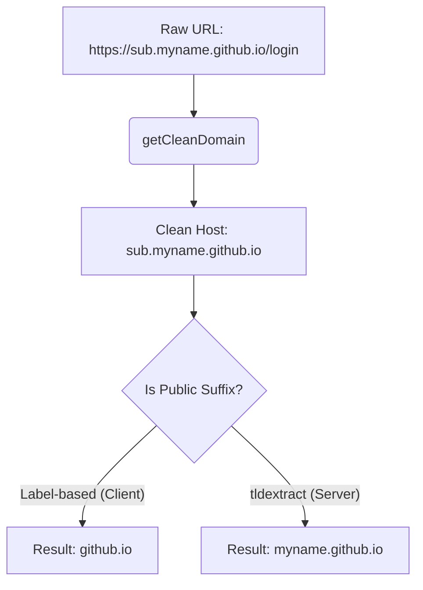

[Home](https://github.com/nishantdec/localpass/blob/main/README.md) •
[Docs Index](../../index.md) •
[Quick Start](https://github.com/nishantdec/localpass/blob/main/QUICKSTART.md) •
[Glossary](../../reference/glossary.md)

---

# Domain Resolution and Matching: `docs/extension/utils/domain.md`

This document details the specifications, design decisions, and methods for domain parsing, cleaning, and trust verification inside **localpass**. It ensures credentials are only filled on exact or trusted matching origins, mitigating phishing vectors.

---

## 1. Architectural Importance

Browser extensions are vulnerable to DNS spoofing and phishing if auto-fill logic matches subdomains loosely (e.g., auto-filling credentials on `login-github.com` because it contains the text `github.com`). 

To address this, localpass applies strict matching filters on both the extension client and the Python backend:
1.  **Extension Client:** Resolves absolute tab URLs into hostnames, strips standard subdomains (`www`), and extracts base registered domains (eTLD+1).
2.  **Python Backend (`domain_trust.py`):** Uses strict Python `tldextract` heuristics to validate true eTLDs (e.g. distinguishing `co.uk` from custom subdomains) to ensure secure matching.

---

## 2. Client-Side Utility Specifications

### A. `getCleanDomain`
Parses raw tab URLs and isolates the lowercase hostname while stripping the standard `www.` prefix.

*   **Signature:** `function getCleanDomain(url)`
*   **Parameters:**
    *   `url` (`string`): The full absolute URL of the active tab.
*   **Returns:** `string` - Lowercase host (e.g., `"github.com"`), or an empty string `""` if the URL is invalid.
*   **Source Code:**
    ```javascript
    function getCleanDomain(url) {
      try { return new URL(url).hostname.replace(/^www\./, ''); }
      catch { return ''; }
    }
    ```
*   **Invokes:** `window.URL` API
*   **Invoked By:** URL change listeners in `localpass-extension/popup/popup.js`.

---

### B. `getBaseDomain`
Decouples subdomains from base domains (e.g., reducing `accounts.google.com` or `mail.google.com` to `google.com`) to enable seamless suggestions across unified properties.

*   **Signature:** `function getBaseDomain(hostname)`
*   **Parameters:**
    *   `hostname` (`string`): The isolated hostname.
*   **Returns:** `string` - The base registered domain (eTLD+1 matching).
*   **Source Code:**
    ```javascript
    function getBaseDomain(hostname) {
      if (!hostname) return '';
      const clean = hostname.replace(/^www\./, '');
      const parts = clean.split('.');
      return parts.length >= 2 ? parts.slice(-2).join('.') : clean;
    }
    ```
*   **Invokes:** None.
*   **Invoked By:** Dashboard renderers inside `localpass-extension/popup/popup.js`.

---

## 3. Server-Side Security Validation: `domain_trust.py`

While the extension uses a lightweight label-slicing heuristic (`parts.slice(-2)`), the Python backend uses `tldextract` to verify domain trust, preventing leaks on public suffixes (such as `github.io`).

### Base Comparison Model



*   **Client matching `github.io`:** Fails if another user registers `phishing.github.io`.
*   **Server matching `myname.github.io`:** Succeeds because it isolates the registered domain (`myname.github.io`) using the Public Suffix List.

---

## 4. Live Verification and Parsing Script

This test script illustrates both client-side label extraction and the server-side Public Suffix safety assertions:

```javascript
// Mock Client Domain Resolution Logic
function clientGetCleanDomain(url) {
  try { return new URL(url).hostname.replace(/^www\./, ''); }
  catch { return ''; }
}

function clientGetBaseDomain(hostname) {
  if (!hostname) return '';
  const clean = hostname.replace(/^www\./, '');
  const parts = clean.split('.');
  return parts.length >= 2 ? parts.slice(-2).join('.') : clean;
}

// Test cases demonstrating varying subdomain depths and TLD classes
const testUrls = [
  "https://www.github.com/login",
  "https://accounts.google.com/signin/v2",
  "https://mail.corp.company.co.uk/inbox",
  "http://myname.github.io/index.html",
  "https://login-github.com/secure"
];

console.log("=== Dynamic Domain Matching Analysis ===");
testUrls.forEach(url => {
  const host = clientGetCleanDomain(url);
  const base = clientGetBaseDomain(host);
  
  console.log(`URL:  ${url}`);
  console.log(`Host: ${host}`);
  console.log(`Base: ${base}`);
  
  // Highlighting safety boundary issues with label slicing vs PSL
  if (host.endsWith("github.io") && base === "github.io") {
    console.warn("⚠️  PSL Edge Case Identified: 'github.io' matches general public suffix instead of registered subdomain.");
  }
  if (host.endsWith("co.uk") && base === "co.uk") {
    console.warn("⚠️  UK eTLD Edge Case Identified: 'co.uk' resolved as root domain instead of registered domain.");
  }
  console.log("-----------------------------------------");
});
```

---

## See Also
- [Extension Overview](../overview.md)
- [Bridge](bridge.md)
- [Detector](detector.md)
- [Filler](filler.md)

---
*[Back to Docs Index](../../index.md) •
[Back to Top](#)*