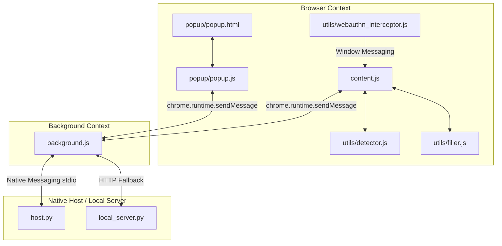

[Home](../README.md) •
[Docs Index](index.md) •
[Quick Start](../QUICKSTART.md) •
[Glossary](reference/glossary.md)

---

# localpass Extension Architecture & Implementation Guide

This document serves as the absolute source of truth for the **localpass** browser extension. It details the file structure, core communication workflows, recent updates, and future items so that any developer or AI assistant can immediately understand the project context without parsing the entire repository.

---

## 1. Extension Directory Structure & Architecture

localpass is a secure, local-first browser extension that integrates seamlessly with a local native messaging host (`com.localpass.host`) or a secure localhost HTTP fallback (`http://127.0.0.1:27432`).

### Core Files Map

| File Path | Execution Context | Description / Purpose |
| :--- | :--- | :--- |
| **`manifest.json`** | Extension Manifest | Declares permissions, background service worker, popup views, content scripts, and security policies. |
| **`background.js`** | Service Worker | The extension's backend controller. Orchestrates messaging with the popup/content scripts, manages authentication tokens (in-memory only), performs handshakes, and communicates with `host.py` / `local_server.py`. |
| **`content.js`** | Content Script (Isolated) | Runs in the context of target web pages. Injects dynamic lock buttons next to input fields, renders and filters the dropdown popover suggestions list, detects logins, and presents the save-credentials prompt banner. |
| **`utils/detector.js`** | Content Script (Isolated) | Loaded before `content.js` to provide DOM scanning utilities (detecting visible forms, passwords, usernames, and OTP fields). |
| **`utils/filler.js`** | Content Script (Isolated) | Loaded before `content.js` to safely dispatch input filling events without breaking frameworks (like React/Angular). |
| **`utils/webauthn_interceptor.js`**| Content Script (Main World)| Injected directly into the page window context at `document_start`. Intercepts standard WebAuthn calls (`navigator.credentials.create` and `get`) and proxies them to `content.js` via `window.postMessage`. |
| **`popup/popup.html`** | Extension Popup (SPA) | The single-page main extension interface markup housing the Vault, Generator, Settings views, and custom confirm overlays. |
| **`popup/popup.js`** | Extension Popup | Manages popup routing, state changes, list rendering, details viewing, and categorized sub-settings. |
| **`popup/popup.css`** | Extension Popup Style | Contains visual tokens, transitions, light/dark themes, and modal layout classes. |
| **`popup/theme-init.js`** | Window Scope | Self-executing script loaded first in HTML files to prevent flash-of-dark-mode by setting the Light Theme default instantly. |
| **`popup/passkey_dialog.html`** | Standalone Popout | Custom dialog spawned during credential registration/assertion, functioning like a native OS dialog. |

---

## 2. What Has Been Added & Completed

### A. Restructured Settings & Navigation Flow
* **Tab-Level Back Button Control**: Resetting the navigation stack (`viewStack = [view]`) on bottom navigation clicks prevents the back-arrow from leaking into main screens.
* **Categorized Sub-menus**: Reorganized Settings into modular subsets: **Appearance** (Theme & popup sizing), **Security & Autofill** (Autofill triggers & passkeys), and **About Extension** (Real-time connection stats and version lists).

### B. Custom Premium Confirmation Modals
* **Custom Confirm UI Overlay**: Replaced the native browser prompt with an elegant `#nl-delete-modal` modal dialog styled with blur backdrops, scale-zoom transitions, warning icons, and matching Cancel/Delete actions.

### C. Backend Favicon Serializations & Square Icons
* **Autofill Suggestion Favicons**: Added domain `"url"` serializations to both `local_server.py` and `host.py` `/credentials` endpoint models to enable icon querying on page inputs.
* **Sharp Square Outlines**: Removed rounded corners (`border-radius: 4px` replaced with sharp lines) on all favicons to follow modern near-ink visual rules.

### D. Hover Transition Effects
* **Micro-interactions**: Enhanced back buttons, nav items, copy actions, and dropdown selections with transition parameters for smooth scaling and tactile responses.

### E. Browser-Level Autofill Integration & Passkey Onboarding
* **Make Default Prompt**: Restructures dynamic requests for optional permissions (`"privacy"`, `"webNavigation"`, `"contextMenus"`) and locks standard browser prompts via `chrome.privacy.services.passwordSavingEnabled.set({ value: false })`.

### F. Syntactic popup.js Repair
* **Init Recovery**: Restored the missing `chrome.storage.local.get(['theme', 'popup_size'], (d) => { ... })` wrapper to resolve console syntax errors and restore flawless default settings fetching.

### G. HTML Nesting Repair
* **Nesting Fix**: Added the missing closing `</nav>` inside `popup.html` to separate modals from the navigation layout, which fully repaired the extension list displays and broken button clicks.

### H. Simple & Compact Single-Row Autofill Suggestions
* **Autofill Simplification**: Redesigned the suggestions dropdown in `content.js` to look incredibly clean and simple (matching the user's mockup). Removed the bloated nested bullet passwords rows and TOTP displays in favor of single-line card items containing the Favicon, semibold Title, avatar outline icon, Username label, and a brand-blue box-arrow fill action.

### I. Real-time Suggestion Query Filtering
* **Intelligent Query Filtering**:
  * If the user is typing in a **Username/Email** field, the dropdown list dynamically filters entries in real-time. If zero results match the typed value, the popover is completely hidden.
  * If the user is typing in a **Password** field, the list automatically filters to only show credentials associated with the typed username, preventing cross-account suggestion noise.

### J. Advanced AJAX / SPA Save Prompts & Light Theme Cards
* **AJAX Login Watcher**: Added an input cache watcher that caches text/email/password inputs as the user types. Detects login submissions on standard forms as well as SPA clicks (Next, Log In, Continue buttons) and Enter keypresses.
* **Premium Light Theme Cards**: If the submitted credentials are new, it slides a beautifully designed, light-mode compliant floating card in the top right (`top: 16px; right: 16px`) offering to save or update the record.

### K. Form-Replacing Sticky Bottom Actions Bar
* **Sticky Bottom Actions**: Completely replaced bottom navigation tabs during Save and Edit screens with a sticky `#nl-form-actions-bar` containing light-blue Save and outlined Cancel buttons. Under the hood, Save triggers standard HTML5 validation programmatically using `form.requestSubmit()` on the active view form.

### L. Strict WebAuthn Prototype Mocking & CBOR Attestation
* **WebAuthn Interceptor Overhaul**: Solved the strict typechecks and verification issues on advanced authentication sites (e.g. Google Accounts) by mapping mock credentials onto native prototype chains (`PublicKeyCredential`, `AuthenticatorAttestationResponse`, and `AuthenticatorAssertionResponse`) using `Object.create` and `Object.defineProperty`.
* **CBOR "none" Attestation Object**: Overhauled the python passkey service (`localpass/core/passkey.py`) to generate standard-compliant CBOR-serialized `"none"` attestation objects containing SHA-256 RP ID hashes, AAGUIDs, credential ID structures, and P-256 public key maps in COSE format. This completely satisfies strict server-side signature and registration checks.

### M. Clean TOTP Display & Sleek Indicator Styling
* **Sleek Gray Icon Badges**: Removed the loud green and yellow background indicator circles from the entries lists. Standardized the badge labels into the clean, low-impact, dark-theme-compliant design system.
* **Smart Live TOTP Warning Colors**: While editing or viewing credentials, the live countdown timer continues to display the real-time code, turning a warm warning orange ONLY during the final 5 seconds before refresh, ensuring optimal utility without layout noise.

### N. Premium Interactive Multi-Folder & Type Filtering System
* **Polymorphic Selector Inputs**: Replaced simple text inputs with rich, dynamically populated dropdown selectors inside Save and Edit forms, letting users assign any entry to an existing folder with one click.
* **Custom Dropdown Popover Overlays**: Overhauled the top filter controls (`#nl-folder-filter-wrap` and `#nl-type-filter-wrap`) in `popup.html` and `popup.js` to render state-of-the-art interactive dropdown lists complete with SVG icons, hover transitions, and active-state styling.
* **Prompt-Free Custom Modal Creation**: Integrated a stunning `#nl-folder-modal` modal overlay that lets users create new folders instantly from both the main top navigation filter bar and the `+ New` dropdown.
* **Dynamic Vault-Filtering Engine**: Programmed the list renderer to instantly filter items in real-time based on the selected folder (including an "Unassigned" query filter) and entry type, allowing rapid multi-level database navigation.

---

## 3. Outstanding Tasks & Next Steps

* [x] **Interactive Multi-Folder Organization**: Complete. Beautifully integrated folder creation, polymorphic inputs, custom filter overlays, and live vault filtering.
* [x] **Refined TOTP Badge Colorway**: Complete. Standardized high-contrast low-noise gray labels in vault listings.
* [ ] **Local Host Process Auto-Restart**: Implement a backend daemon auto-restarter wrapper if the server falls offline or loses sync.
* [ ] **Password History Cleardown**: Provide a button in Settings to purge the browser's stored password generation history values.
* [ ] **Auto-lock Timeout**: Add a security timeout option in Settings to auto-lock the session/token after X minutes of user inactivity.

---

## See Also
- [Architecture Overview](architecture/overview.md)
- [Debugging](guides/debugging.md)
- [Glossary](reference/glossary.md)

---
*[Back to Docs Index](index.md) •
[Back to Top](#)*