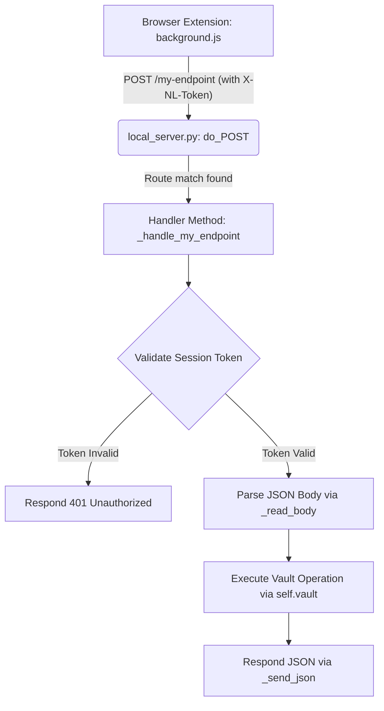

[Home](../../README.md) •
[Docs Index](../index.md) •
[Quick Start](../../QUICKSTART.md) •
[Glossary](../reference/glossary.md)

---

# Extensibility Guide: Adding a New Local Server Endpoint: `docs/guides/adding-a-new-endpoint.md`

This developer manual provides a comprehensive, step-by-step walkthrough for extending the loopback REST API server in `server/local_server.py`. It shows how to add a secure endpoint, authenticate calls, interact with the vault backend, and connect it to the browser extension.

---

## 1. Loopback Server Routing Architecture

The loopback server runs locally as a standard, light `HTTPServer` on `127.0.0.1:27432`. It exposes POST endpoints to the browser extension and uses a dictionary mapping for routing requests inside the `do_POST` handler.



### Core Security and Routing Helpers
When adding new endpoints, you must use the following pre-defined helper methods in `localpassHandler`:

*   **`self._check_token()`:** Validates the `X-NL-Token` header. Always call this first on protected endpoints to prevent unauthorized access.
*   **`self._read_body()`:** Reads the incoming request's stream and parses the body as a JSON dictionary.
*   **`self._send_json(status_code, data_dict)`:** Sends a formatted JSON response, automatically injecting the required CORS headers to permit communication from approved Chrome extension origins.

---

## 2. Step-by-Step Implementation Guide

To illustrate the integration process, this guide walks through implementing a new feature: **Favouriting a credential item** (`POST /entries/favorite`) directly from the extension.

### Step 1: Define the Backend Vault Operation
First, verify that the operation is supported by the `VaultAdapter` (in `localpass/core/adapter.py`). If not, add the method to the adapter:

```python
# Added to localpass/core/adapter.py
def toggle_favorite(self, entry_id: str) -> bool:
    """Toggles the favorite state of a specific credential entry in the vault."""
    entry = self.get_entry(entry_id)
    if not entry:
        return False
    entry.preferred = not getattr(entry, "preferred", False)
    self.save()  # Commit the changes securely
    return True
```

---

### Step 2: Create the HTTP Route Handler
Open `server/local_server.py` and define your custom handler method inside the `localpassHandler` class. Keep endpoint names clean and use snake_case for handler methods:

```python
# Define inside class localpassHandler in server/local_server.py
def _handle_entry_favorite(self):
    """
    POST /entries/favorite
    Payload: {"id": "<entry_id>"}
    Response: {"success": true, "favorite": true/false}
    """
    # 1. Enforce authentication checking
    if not self._check_token():
        self._send_json(401, {"error": "unauthorized"})
        return

    # 2. Parse request payload
    body = self._read_body()
    entry_id = body.get("id", "")
    if not entry_id:
        self._send_json(400, {"error": "id_required"})
        return

    # 3. Access the vault adapter using the thread-safe reference
    if not self._vault_ready():
        self._send_json(503, {"error": "vault_locked_or_uninitialized"})
        return

    # 4. Perform the operation and check for success
    try:
        entry = self.vault.get_entry(entry_id)
        if not entry:
            self._send_json(404, {"error": "entry_not_found"})
            return
            
        success = self.vault.toggle_favorite(entry_id)
        
        # 5. Return a secure response
        self._send_json(200, {
            "success": success,
            "favorite": getattr(entry, "preferred", False)
        })
    except Exception as e:
        debug(f"Error toggling favorite on {entry_id}: {e}")
        self._send_json(500, {"error": "internal_server_error"})
```

---

### Step 3: Register the POST Route mapping
Locate the `do_POST` method in `localpassHandler` and add your new endpoint to the `routes` dictionary:

```python
def do_POST(self):
    debug(f"do_POST called: path={self.path}, origin={self._origin()}")
    try:
        routes = {
            "/handshake":       self._handle_handshake,
            "/credentials":     self._handle_credentials,
            "/search":          self._handle_search,
            "/entries":         self._handle_entries_create,
            "/entry":           self._handle_entry,
            "/entries/update":  self._handle_entry_update,
            "/entries/delete":  self._handle_entry_delete,
            "/totp":            self._handle_totp,
            "/copy":            self._handle_copy,
            "/fill":            self._handle_fill,
            "/passkeys":          self._handle_passkeys,
            "/passkeys/register": self._handle_passkeys_register,
            "/passkeys/sign":     self._handle_passkeys_sign,
            "/increment_usage":   self._handle_increment_usage,
            
            # Register the new route mapping here
            "/entries/favorite":  self._handle_entry_favorite,
        }
        handler = routes.get(self.path)
        if handler:
            handler()
        else:
            debug(f"POST route not found: {self.path}")
            self._send_json(404, {"error": "not_found"})
    except Exception as e:
        debug(f"Error in do_POST: {e}")
        self._send_json(500, {"error": "internal_server_error"})
```

---

### Step 4: Add the Client-Side API Dispatcher
Finally, update the browser extension's background script `localpass-extension/background.js` to dispatch messages to the new endpoint.

Add the handler inside the `chrome.runtime.onMessage` listener in `background.js`:

```javascript
// Add inside background.js message switch block
async function handleBackgroundMessages(request, sender, sendResponse) {
  switch (request.type) {
    // Existing routes...
    case 'TOGGLE_FAVORITE':
      try {
        const response = await httpCall('/entries/favorite', { id: request.id });
        sendResponse(response);
      } catch (err) {
        sendResponse({ error: 'failed_to_favorite_item', details: err.message });
      }
      return true; // Keep message channel open for asynchronous responses
  }
}
```

Now, components like `popup.js` can trigger the action:
```javascript
chrome.runtime.sendMessage({ type: 'TOGGLE_FAVORITE', id: 'some-guid-123' }, (response) => {
  if (response && response.success) {
     console.log(`Favorite state toggled. Is favorite: ${response.favorite}`);
  }
});
```

---

## 3. Integration Testing & Verification

### Verification via `curl`
To test your new endpoint locally, use a terminal client like `curl`. Because the server enforces CORS and token security, you must simulate the extension by providing an origin header and a valid session token:

```bash
# 1. Acquire an authentication token via handshake
curl -X POST http://127.0.0.1:27432/handshake \
  -H "Origin: chrome-extension://abcdefghijklmnopqrstuvwxyz" \
  -H "Content-Type: application/json" \
  -d '{"challenge":"12345678901234567890123456789012"}'

# Response: {"token":"session_token_xyz123","response":"hmac_hex..."}

# 2. Trigger the new endpoint with the session token
curl -X POST http://127.0.0.1:27432/entries/favorite \
  -H "Origin: chrome-extension://abcdefghijklmnopqrstuvwxyz" \
  -H "X-NL-Token: session_token_xyz123" \
  -H "Content-Type: application/json" \
  -d '{"id":"test-entry-uuid-guid"}'

# Expected Response: {"success": true, "favorite": true}
```

---

## See Also
- [Replicating The System](replicating-the-system.md)
- [Debugging](debugging.md)
- [Adding A New View](adding-a-new-view.md)
- [Building Exe](building-exe.md)

---
*[Back to Docs Index](../index.md) •
[Back to Top](#)*