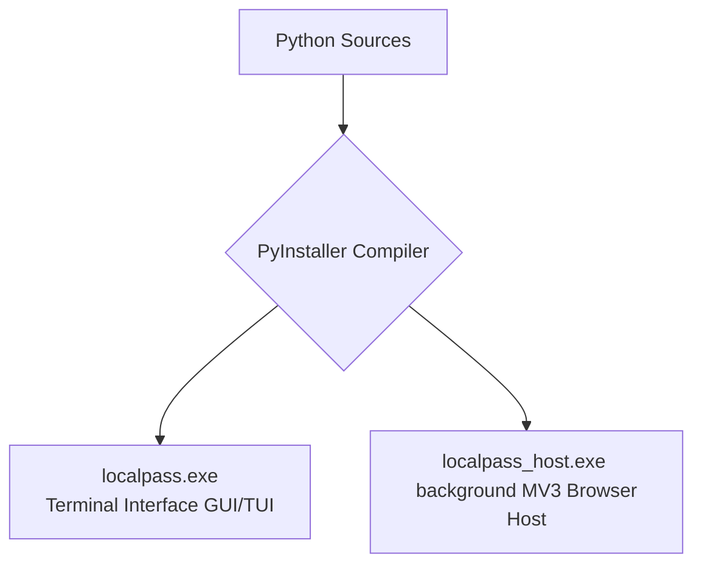

[Home](https://github.com/nishantdec/localpass/blob/main/README.md) •
[Docs Index](../index.md) •
[Quick Start](https://github.com/nishantdec/localpass/blob/main/QUICKSTART.md) •
[Glossary](../reference/glossary.md)

---

# Windows Packaging Guide with PyInstaller: `docs/guides/building-exe.md`

This guide explains how to package **localpass** (the terminal TUI dashboard and the background WebExtension native messaging host) into standalone Windows executables (`.exe`) using PyInstaller.

---

## 1. Architectural Strategy and Targets

When packaging localpass for production distribution, we compile two decoupled binary targets to separate the foreground keyboard terminal context from the background browser-native IPC bridge.



### Build Specifications
*   **Console Mode:** `localpass.exe` requires standard console buffers to render the terminal UI. `localpass_host.exe` must run with console outputs disabled to prevent spawning command windows whenever Chrome calls it.
*   **Module Inclusion:** Dynamic terminal libraries (`prompt_toolkit`) and crypto bindings must be bundled explicitly to prevent runtime import exceptions.

---

## 2. Production PyInstaller Spec Files

To compile reproducible builds, create a PyInstaller `.spec` file in the workspace root named `localpass-build.spec`. It specifies configurations for both targets.

```python
# -*- mode: python ; coding: utf-8 -*-
# localpass-build.spec

import os
import sys
from PyInstaller.utils.hooks import collect_all

# Add workspace parent to path
sys.path.insert(0, os.path.abspath('.'))

# ── Target 1: localpass Terminal UI CLI ──────────────────────────
tui_datas = []
tui_binaries = []
tui_hiddenimports = [
    'prompt_toolkit',
    'prompt_toolkit.input',
    'prompt_toolkit.output',
    'cryptography',
    'tldextract',
]

# Collect all resources and files for prompt_toolkit
tmp_datas, tmp_binaries, tmp_hidden = collect_all('prompt_toolkit')
tui_datas.extend(tmp_datas)
tui_binaries.extend(tmp_binaries)
tui_hiddenimports.extend(tmp_hidden)

tui_analysis = Analysis(
    ['localpass/main.py'],
    pathex=[],
    binaries=tui_binaries,
    datas=tui_datas,
    hiddenimports=tui_hiddenimports,
    hookspath=[],
    hooksconfig={},
    runtime_hooks=[],
    excludes=[],
    noarchive=False,
)

tui_pyz = PYZ(tui_analysis.pure)

tui_exe = EXE(
    tui_pyz,
    tui_analysis.scripts,
    tui_analysis.binaries,
    tui_analysis.datas,
    [],
    name='localpass',
    debug=False,
    bootloader_ignore_signals=False,
    strip=False,
    upx=True,
    upx_exclude=[],
    runtime_tmpdir=None,
    console=True, # Console true: essential for TUI prompt buffers
    disable_windowed_traceback=False,
    argv_emulation=False,
    target_arch=None,
    codesign_identity=None,
    entitlements_file=None,
)

# ── Target 2: WebExtension Background Native Host ─────────────────────
host_datas = []
host_binaries = []
host_hiddenimports = ['cryptography']

host_analysis = Analysis(
    ['localpass/native_host/host.py'],
    pathex=[],
    binaries=host_binaries,
    datas=host_datas,
    hiddenimports=host_hiddenimports,
    hookspath=[],
    hooksconfig={},
    runtime_hooks=[],
    excludes=[],
    noarchive=False,
)

host_pyz = PYZ(host_analysis.pure)

host_exe = EXE(
    host_pyz,
    host_analysis.scripts,
    host_analysis.binaries,
    host_analysis.datas,
    [],
    name='localpass_host',
    debug=False,
    bootloader_ignore_signals=False,
    strip=False,
    upx=True,
    upx_exclude=[],
    runtime_tmpdir=None,
    console=False, # Console false: avoids terminal windows popups inside the browser
    disable_windowed_traceback=False,
    argv_emulation=False,
    target_arch=None,
    codesign_identity=None,
    entitlements_file=None,
)
```

---

## 3. Step-by-Step Compilation Commands

Execute the following commands in an elevated PowerShell session in the workspace directory:

### Step 1: Install Build Tools
Ensure PyInstaller and production dependency extensions are installed:
```powershell
pip install -r requirements.txt
pip install pyinstaller
```

### Step 2: Run Compilation
Compile both targets in one pass using the spec configuration:
```powershell
pyinstaller --clean localpass-build.spec
```

Once compilation completes:
*   The raw files appear under the `build/` directory.
*   The final ready-to-run executables appear under the `dist/` folder:
    *   `dist/localpass.exe` (Terminal UI application)
    *   `dist/localpass_host.exe` (Background native host receiver)

---

## 4. Troubleshooting and Edge Cases

### A. Missing `prompt_toolkit` Layouts at Launch
*   **Symptom:** Executable launches and crashes immediately with `ModuleNotFoundError: No module named 'prompt_toolkit.input.win32'`.
*   **Resolution:** PyInstaller's static code analyzer fails to trace prompt-toolkit's dynamic lazy imports on Windows. Double check that the `.spec` file includes the `collect_all('prompt_toolkit')` hook before compiling.

### B. Antivirus False Positives
*   **Symptom:** Windows Defender alerts "Trojan:Win32/PreventativeDetect" when generating or executing compiled files.
*   **Resolution:** PyInstaller bootloaders can trigger false positives on heuristics scanners. Signing the generated binary with a self-signed local certificate mitigates this issue:
    ```powershell
    # Generate local dev signing certificate
    New-SelfSignedCertificate -Type Custom -Subject "CN=localpassDev" -KeyUsage DigitalSignature -FriendlyName "localpass Signing" -CertStoreLocation "Cert:\CurrentUser\My"
    
    # Sign the output binary using Windows SDK sign tools
    signtool sign /a /t http://timestamp.digicert.com dist/localpass.exe
    signtool sign /a /t http://timestamp.digicert.com dist/localpass_host.exe
    ```

### C. Native Message Registry Path Matching
*   **Symptom:** Chrome extension yields `Error: Specified native messaging host not found`.
*   **Resolution:** Re-run the host installer `manifest_installer.py` pointing directly to the new `localpass_host.exe` binary.
    ```powershell
    python localpass/native_host/manifest_installer.py --path "D:\Dev\Projects\Active\NorthLcoker\dist\localpass_host.exe"
    ```
    This updates Chrome's Windows Registry path under `HKEY_CURRENT_USER\Software\Google\Chrome\NativeMessagingHosts\com.localpass.host` to resolve your compiled executable.

---

## See Also
- [Replicating The System](replicating-the-system.md)
- [Debugging](debugging.md)
- [Adding A New View](adding-a-new-view.md)
- [Adding A New Endpoint](adding-a-new-endpoint.md)

---
*[Back to Docs Index](../index.md) •
[Back to Top](#)*