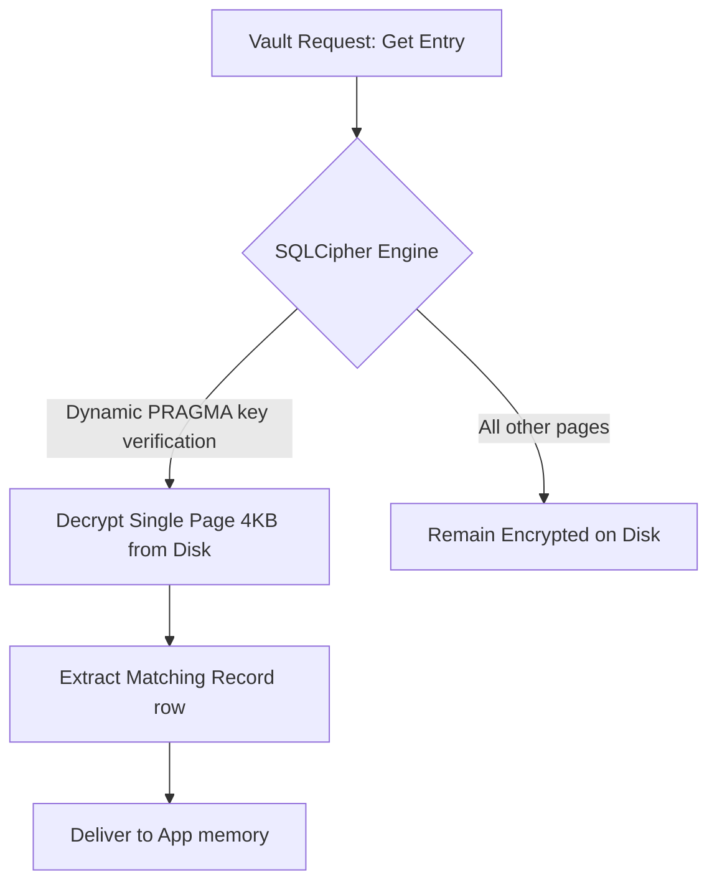
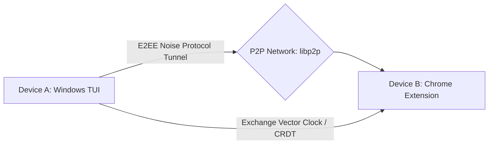

[Home](../../README.md) •
[Docs Index](../index.md) •
[Quick Start](../../QUICKSTART.md) •
[Glossary](../reference/glossary.md)

---

# Technical Roadmap: SQLCipher, Biometrics & Sync Protocols: `docs/guides/future-features.md`

This document details the engineering specifications, cryptographic blueprints, and structural designs for features scheduled for the next major version of **localpass**.

---

## 1. SQLCipher: Decoupled High-Performance Vault Engine

### Current Architecture Limitations
Currently, localpass decrypts the entire JSON vault envelope into local application memory at unlock time. Any modifications require serializing, signing, and encrypting the entire dataset, which creates a larger memory attack surface and degrades performance with large numbers of entries.

### SQLCipher Storage Engine Specs
The planned architecture migrates persistence to an embedded **SQLCipher (SQLite extension)** database. This provides page-level cryptographic encryption (via AES-256-CBC and PBKDF2) using a secure local key.



### Strategic Benefits
*   **Minimal Memory Footprint:** Individual fields or records are decrypted on-the-fly. The entire database never resides in memory concurrently in plaintext.
*   **ACID Compliance:** Uses database transactions to prevent corruption during power cuts or unexpected program exits.
*   **Indices:** Facilitates binary-tree indexing on fields like `rp_id` or `title`, accelerating searches from $\mathcal{O}(N)$ scanning to $\mathcal{O}(\log N)$ lookups.

### Database Encryption Initialization Strategy
```sql
-- Establish cryptographic credentials immediately upon opening the connection
PRAGMA key = "x'derived_argon2id_master_key_hex_64_chars'";
PRAGMA cipher_page_size = 4096; -- Optimal page alignment block
PRAGMA kdf_iter = 256000;      -- Enhanced key derivation passes
```

---

## 2. Biometric Authentication Integration (Windows Hello / TPM)

Biometric unlocking allows users to open their vault securely using Windows Hello (PIN, Fingerprint, or Face recognition) by utilizing hardware-bound keys.

```text
[First Setup] 
Master Key derived ──► TPM 2.0 generates RSA keypair ──► Master Key encrypted via TPM Public Key ──► Encrypted Key saved to disk
                                                                                  
[Subsequent Unlocks]
User provides Biometric ──► Windows Hello approves ──► TPM Private Key decrypts block ──► Master Key returned to process memory
```

### Implementation Specifications (Win32 & WinRT APIs)
1.  **Enclave Cryptography:** The application leverages the WinRT `Windows.Security.Credentials.KeyCredentialManager` API.
2.  **TPM Attestation:** A hardware-bound RSA keypair is generated inside the Trusted Platform Module (TPM 2.0). The private key remains locked behind biometric authorization.
3.  **Encrypted Key Escrow:** The master vault key is encrypted with the TPM's public key and saved alongside local application assets.
4.  **Decryption Protocol:** When the user unlocks the TUI or browser popup:
    *   The application prompts the OS for biometric authorization.
    *   Once validated, the TPM private key decrypts the master key and returns it to volatile RAM.

---

## 3. Decentralized Vault Synchronization (P2P E2EE)

To sync vaults across multiple client devices without relying on a centralized cloud database, localpass will implement a secure peer-to-peer (P2P) synchronization protocol.



### Sync Specification Protocol Stack

| Layer | Protocol | Implementation Specification |
| :--- | :--- | :--- |
| **Transport** | WebRTC / TCP Relay | Establishes direct NAT-punching communication using STUN/TURN helpers. |
| **Secure Handshake** | Noise Protocol (XX pattern)| Performs a mutually authenticated key exchange based on pre-shared public identity keys. |
| **Data Synchronization** | CRDT (Conflict-Free Replicated Data Types) | Uses state-based vector clocks to resolve edits across offline devices without data loss. |
| **Encryption** | XChaCha20-Poly1305 | Provides authenticated end-to-end encryption for sync payloads, keeping transport relays blind to the contents. |

### CRDT Conflict Resolution Logic
Every item update includes an incremental sequence counter and a high-resolution UTC timestamp. Conflicts are resolved deterministically using a **LWW-Element-Set** (Last-Write-Wins-Element-Set) approach:

$$\text{Resolve}(A, B) = \max(A.\text{timestamp}, B.\text{timestamp})$$

This ensures that concurrent modifications across disconnected devices merge cleanly once the devices reconnect.

---

## See Also
- [Replicating The System](replicating-the-system.md)
- [Debugging](debugging.md)
- [Adding A New View](adding-a-new-view.md)
- [Adding A New Endpoint](adding-a-new-endpoint.md)
- [Building Exe](building-exe.md)

---
*[Back to Docs Index](../index.md) •
[Back to Top](#)*