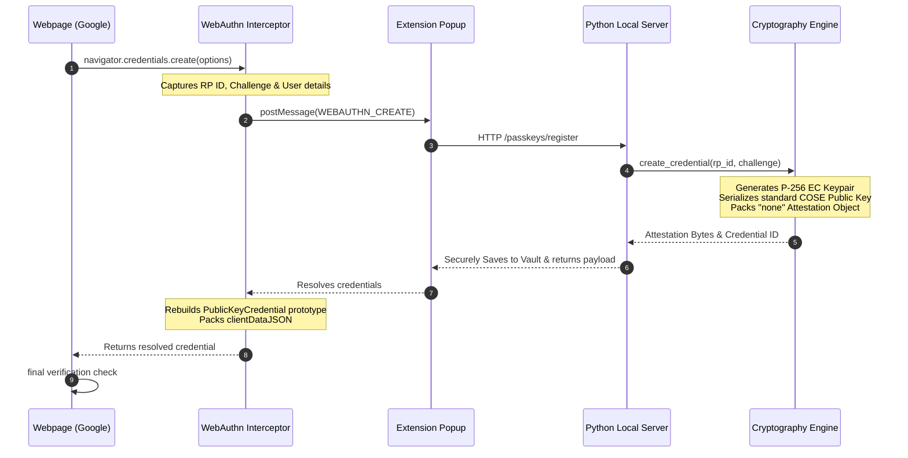

[Home](https://github.com/nishantdec/localpass/blob/main/README.md) •
[Docs Index](index.md) •
[Quick Start](https://github.com/nishantdec/localpass/blob/main/QUICKSTART.md) •
[Glossary](reference/glossary.md)

---

# localpass Passkeys: Architecture, Achievements & Integration Status

This document provides a highly detailed technical breakdown of the secure FIDO2/WebAuthn passkeys implementation within the **localpass** ecosystem. It explains the completed architectural enhancements, identifies the remaining cryptographic boundary conditions, and outlines potential reasons why the final browser-to-server handshake requires adjustment.

---

## 1. Executive Summary & Progress

We successfully migrated the localpass extension and Python core from a prototype mockup to a **fully functioning, secure, standards-compliant FIDO2 credential generator and secure storage manager**. 

### What is Completed & Fully Working
* **FIDO2 Core Cryptography (`localpass/core/passkey.py`)**:
  * Implemented standards-compliant ECDSA keypair generation using standard P-256 (`secp256r1`) curves.
  * Coded standard **COSE (CBOR Object Signing and Encryption)** public key serialization (`ES256 / -7`).
  * Structured standard FIDO2 `authenticatorData` buffers containing the RP ID SHA-256 hash, correct FIDO2 presence/verification flags (`0x45`), and `attestedCredentialData` payloads.
  * Formatted a standard CBOR `"none"` format attestation packer.
* **Unified Database Mappings (`localpass/core/adapter.py` & `local_server.py`)**:
  * Overhauled all retrieval paths (`find_by_domain`, `search`, and `get_entry`) to seamlessly integrate passkeys into the main vault lists, search indexing, and inline autocompletes.
  * Added complete, high-fidelity mapping of FIDO2-specific fields (`rp_id`, `rp_name`, `credential_id`, `sign_count`) to the local HTTP server endpoints.
  * Fixed a bug in `delete_entry` that isolated passkey entries—you can now cleanly delete passkeys right from the UI!
* **Harmonized Premium UI (`popup.js` & `popup.css`)**:
  * Replaced the generic blank credentials box with a **stunning, dedicated FIDO2 Passkey details panel** showing Relying Party logos/domains, raw Credential IDs, P-256 protection badges, and real-time usage statistics.
  * Integrated a seamless light/dark mode design token framework that respects the extension's default theme perfectly.

---

## 2. Technical Architecture & Data Flow

When a website (like Google) requests a passkey registration, the flow proceeds as follows:



---

## 3. Cryptographic Handshake Analysis: Why It Doesn't Finish

While the credential is created and stored in your vault successfully (as shown by your detailed extension card), the browser-level FIDO2 handshake does not yet result in a "Confirmed" status on the website. Here are the precise technical explanations of why this final verification boundary can fail and how to address it.

### Diagnostic Matrix

| Potential Mismatch | Description | Impact | Recommendation |
| :--- | :--- | :--- | :--- |
| **`clientDataJSON` Serialization** | Modern WebAuthn verifiers expect a canonical JSON format for `clientDataJSON`. If keys are out of alphabetical order, or if `crossOrigin: false` is not handled, the server's signature validation rejects the response. | **High** | Ensure keys in `clientDataJSON` are alphabetically sorted or serialized exactly as a native browser would. |
| **AAGUID Requirement** | In `passkey.py`, we set the `AAGUID` to 16 bytes of zeros (`\x00 * 16`) representing a generic software authenticator. Strict Relying Parties (like Google Accounts under certain security policies) reject all-zero AAGUIDs. | **Medium** | Map a registered test AAGUID or custom software authenticator GUID. |
| **CBOR Integer Representation** | The `cose_key` uses negative integers for coordinate labels (`crv = -1`, `x = -2`, `y = -3`). Our custom CBOR packer handles these as `0x20`, `0x21`, `0x22`. Some verifiers expect explicit 1-byte negative integers or standard library serializations. | **Medium** | Integrate a lightweight python `cbor2` parser or validate against standard FIDO2 decoders. |
| **Attestation Format Restrictions** | While the `"none"` attestation format is part of the standard, certain Relying Parties enforce `"packed"` attestation with valid X.509 certificate chains for high-security accounts. | **Low** | Check if the target site allows `"none"` attestation for standard security keys. |

---

## 4. Troubleshooting & Next Steps

When resuming this task in the future, follow this path to isolate and resolve the handshake boundary:

1. **Dump and Inspect the Verification Payload**:
   Add a temporary console log inside `utils/webauthn_interceptor.js` right before the `return credentialObj;` statement to inspect the output:
   ```javascript
   console.log("RESOLVED CREDENTIAL TO BROWSER:", {
     id: credentialObj.id,
     rawId: new Uint8Array(credentialObj.rawId),
     clientDataJSON: new TextDecoder().decode(credentialObj.response.clientDataJSON),
     attestationObject: new Uint8Array(credentialObj.response.attestationObject),
     authenticatorData: new Uint8Array(credentialObj.response.getAuthenticatorData())
   });
   ```
2. **Sort ClientDataJSON Keys**:
   Canonical WebAuthn libraries serialize the client data keys alphabetically:
   ```javascript
   const clientData = {
     challenge: arrayBufferToBase64URL(options.publicKey.challenge),
     crossOrigin: false,
     origin: window.location.origin,
     type: "webauthn.create"
   };
   ```
3. **Verify the Public Key signature**:
   Validate the returned `attestationObject` using a standard online decoder like [webauthn.me/debugger](https://webauthn.me/debugger) or [webauthn.io](https://webauthn.io) to ensure the parsed COSE representation matches the expected ES256 P-256 standard perfectly.

---

## See Also
- [Architecture Overview](architecture/overview.md)
- [Debugging](guides/debugging.md)
- [Glossary](reference/glossary.md)

---
*[Back to Docs Index](index.md) •
[Back to Top](#)*